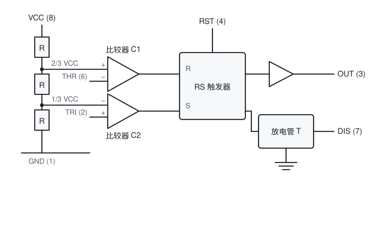

[数电](./数电.md) / 第十章 脉冲波形的产生和整形 / 10.5 555定时器

# 555定时器

## 核心结论

555 定时器内部是"**三个 5 kΩ 电阻组成的分压器 + 两个电压比较器 + 一个基本 RS 触发器 + 一个放电三极管 + 输出缓冲器**". 因为参考电压取自电阻分压的**比值**($\frac{1}{3}V_{CC}$ 与 $\frac{2}{3}V_{CC}$), 所以它对电源电压变化不敏感, 这是它优于普通门电路定时电路的关键.

## 一、内部结构

**各部分作用**:

| 部分           | 作用                                                                                                  |
| -------------- | ----------------------------------------------------------------------------------------------------- |
| 三个 5 kΩ 电阻 | 把 $V_{CC}$ 分压, 提供 $\frac{1}{3}V_{CC}$ 与 $\frac{2}{3}V_{CC}$ 两个参考电压(器件名"555"即来源于此) |
| 上比较器 C1    | 同相端接 $\frac{2}{3}V_{CC}$, 反相端接 6 脚(THR).THR 高于参考时输出高, 使触发器**复位**               |
| 下比较器 C2    | 反相端接 $\frac{1}{3}V_{CC}$, 同相端接 2 脚(TRI).TRI 低于参考时输出高, 使触发器**置位**               |
| 基本 RS 触发器 | 接收比较器输出, 决定输出状态                                                                          |
| 放电三极管 T   | 集电极开路接到 7 脚(DIS), 导通时把外接电容放电                                                        |
| 输出缓冲器     | 提高驱动能力, 输出电流可达 200 mA                                                                     |

## 二、引脚功能

| 引脚 | 名称          | 功能                                                      |
| ---- | ------------- | --------------------------------------------------------- |
| 1    | GND           | 接地                                                      |
| 2    | TRI(触发)     | 低于 $\frac{1}{3}V_{CC}$ 时使输出变高(置位)               |
| 3    | OUT           | 输出, 高低电平分别为约 $V_{CC} - 1.5\ \text{V}$ 与 0.1 V  |
| 4    | RST(复位)     | **低电平有效**, 为 0 时强制输出为 0, 优先级最高           |
| 5    | VCO(控制电压) | 可外接电压改变内部参考; 不用时经 0.01 微法电容接地        |
| 6    | THR(阈值)     | 高于 $\frac{2}{3}V_{CC}$ 时使输出变低(复位)               |
| 7    | DIS(放电)     | 集电极开路, 导通时对外接电容放电                          |
| 8    | VCC           | 电源, 4.5 V 至 16 V(双极型 555), CMOS 版(7555) 可低至 2 V |

## 三、功能表

| RST(4 脚) | THR(6 脚)             | TRI(2 脚)             | OUT(3 脚) | 放电管(7 脚) |
| --------- | --------------------- | --------------------- | --------- | ------------ |
| 0         | $\times$              | $\times$              | 0         | 导通         |
| 1         | $> \frac{2}{3}V_{CC}$ | $\times$              | 0         | 导通         |
| 1         | $< \frac{2}{3}V_{CC}$ | $< \frac{1}{3}V_{CC}$ | 1         | 截止         |
| 1         | $< \frac{2}{3}V_{CC}$ | $> \frac{1}{3}V_{CC}$ | 保持      | 保持         |

**读表要点**: 6 脚与 2 脚是"或"的关系—只要 6 脚超过上门限就复位, 只要 2 脚低于下门限就置位, 两者都不满足时保持.

## 四、应用一: 施密特触发器

**接法**: 把 2 脚与 6 脚并联作为输入端.

| 参数              | 值                  |
| ----------------- | ------------------- |
| 上限阈值 $V_{T+}$ | $\frac{2}{3}V_{CC}$ |
| 下限阈值 $V_{T-}$ | $\frac{1}{3}V_{CC}$ |
| 回差 $\Delta V_T$ | $\frac{1}{3}V_{CC}$ |

若 5 脚外接控制电压 $V_{CO}$, 则阈值变为 $V_{T+} = V_{CO}$,$V_{T-} = \frac{1}{2}V_{CO}$, 实现**阈值可调**.

## 五、应用二: 单稳态触发器

**接法**:

- 6 脚与 7 脚并联, 接 $R$(到 $V_{CC}$) 与 $C$(到地).
- 2 脚接触发输入(低电平触发).
- 5 脚经 0.01 微法电容接地.

**脉宽**:

$$t_w = RC \ln 3 \approx 1.1 RC$$

**约束**: 触发脉冲宽度必须小于 $t_w$, 否则需先微分整形.

## 六、应用三: 多谐振荡器

**接法**:

- $R_1$:$V_{CC}$ 到 7 脚.
- $R_2$: 7 脚到 2,6 脚.
- $C$: 2,6 脚到地.

**参数**:

$$t_1 \approx 0.69 (R_1 + R_2) C \quad \text{(输出高电平时间)}$$

$$t_2 \approx 0.69 R_2 C \quad \text{(输出低电平时间)}$$

$$T \approx 0.69 (R_1 + 2R_2) C$$

$$f \approx \frac{1.43}{(R_1 + 2R_2) C}$$

$$q = \frac{R_1 + R_2}{R_1 + 2R_2} > 50\%$$

**占空比可调改进**: 在 $R_2$ 两端并联二极管(阳极在 7 脚侧), 使充放电路径分离,$q = \dfrac{R_1}{R_1 + R_2}$, 取 $R_1 = R_2$ 即得 50%.

## 七、参数计算示例

**题目**: 用 555 构成频率为 1 kHz, 占空比为 60% 的多谐振荡器, 取 $C = 0.01\ \mu\text{F}$, 求 $R_1$,$R_2$.

**求解**:

$$T = \frac{1}{f} = 1\ \text{ms}$$

由 $q = \dfrac{R_1 + R_2}{R_1 + 2R_2} = 0.6$, 整理得

$$R_1 + R_2 = 0.6(R_1 + 2R_2) \Rightarrow 0.4R_1 = 0.2R_2 \Rightarrow R_2 = 2R_1$$

代入周期公式:

$$T = 0.69(R_1 + 2R_2)C = 0.69(R_1 + 4R_1)C = 0.69 \times 5R_1 C$$

$$R_1 = \frac{T}{0.69 \times 5 \times C} = \frac{1 \times 10^{-3}}{0.69 \times 5 \times 10^{-8}} \approx 29\ \text{k}\Omega$$

$$R_2 = 2R_1 \approx 58\ \text{k}\Omega$$

实际取标称值 $R_1 = 30\ \text{k}\Omega$,$R_2 = 56\ \text{k}\Omega$, 再实测微调.

## 八、555 的主要参数

| 参数         | 双极型 555    | CMOS 型(7555)          |
| ------------ | ------------- | ---------------------- |
| 电源电压     | 4.5 V 至 16 V | 2 V 至 18 V            |
| 静态电流     | 约 3 mA(5 V)  | 约 60 微安             |
| 输出电流     | 约 200 mA     | 约 10 mA(灌)/ 2 mA(拉) |
| 最高振荡频率 | 约 500 kHz    | 约 1 MHz               |
| 定时精度     | 约 1%         | 约 1%                  |
| 温度漂移     | 约 50 ppm/°C  | 略优                   |

## 九、使用要点

1. **5 脚必须处理**: 不用时经 0.01 微法电容接地, 否则内部参考电压易受干扰, 定时不准.
2. **电源去耦**: 8 脚附近接 0.1 微法去耦电容(双极型 555 在输出翻转瞬间会产生数百毫安的电流尖峰).
3. **4 脚不要悬空**: 不用时接 $V_{CC}$.
4. **输出驱动**: 可直接驱动 LED, 继电器, 蜂鸣器; 驱动继电器时要并联续流二极管.
5. **R 的取值范围**:$R$ 太小(小于 1 kΩ) 会使放电管电流过大;$R$ 太大(大于数兆欧) 时电容漏电流不可忽略, 定时不准.
6. **C 的选择**: 避免用电解电容, 推荐 CBB 或瓷片电容.

## 十、常见故障

| 现象               | 原因                                       |
| ------------------ | ------------------------------------------ |
| 输出一直为高       | 2 脚被持续拉低; 4 脚悬空或为低             |
| 不起振             | 接线错误, 5 脚未接旁路电容,$R$ 或 $C$ 开路 |
| 频率严重偏离计算值 | 电容漏电大, 5 脚受干扰, 电源电压过低       |
| 输出波形毛刺多     | 电源未去耦                                 |
| 芯片发热           | 输出短路, 放电管电流过大($R_1$ 太小)       |

## 易错点

- 忘记给 5 脚接旁路电容: 这是 555 定时不准最常见的原因.
- 认为占空比公式中的 $R_1$,$R_2$ 可以随意取值: 标准接法下占空比必然大于 50%, 要更小必须改接二极管.
- 把 4 脚(复位) 悬空: 555 的 4 脚为低电平有效, 悬空时易受干扰导致电路被意外复位.

## 相关笔记

- 前置:[脉冲波形参数](./脉冲波形参数.md)
- 三种应用:[施密特触发器](./施密特触发器.md),[单稳态触发器](./单稳态触发器.md),[多谐振荡器](./多谐振荡器.md)
- 精度对比:[计数器](./计数器.md)
