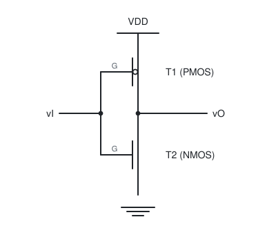

[数电](./数电.md) / 第三章 门电路 / 3.3 CMOS门电路 / CMOS反相器

# CMOS反相器

## 核心结论

CMOS 反相器由一个 PMOS 管和一个 NMOS 管**互补串联**构成, 两管栅极相连作输入, 漏极相连作输出. 它的核心优势是:**静态时总有一管截止, 电源到地无直流通路, 静态功耗几乎为零**.

## 一、电路结构

结构要点:

1. **T1 为 PMOS 管**, 源极接 $V_{DD}$, 栅极接输入 $v_I$.
2. **T2 为 NMOS 管**, 源极接地, 栅极接输入 $v_I$.
3. 两管**栅极并联**作为输入端,**漏极并联**作为输出端.
4. PMOS 的开启条件为 $v_{GS} < V_{thP}$($V_{thP}$ 为负值), NMOS 的开启条件为 $v_{GS} > V_{thN}$($V_{thN}$ 为正值).

## 二、工作原理

| 输入 $v_I$            | PMOS(T1)                 | NMOS(T2)                          | 输出 $v_O$                |
| --------------------- | ------------------------ | --------------------------------- | ------------------------- |
| 低电平 0(约 0 V)      | $v_{GS} = -V_{DD}$, 导通 | $v_{GS} = 0 < V_{thN}$, 截止      | 被上拉到 $V_{DD}$, 输出 1 |
| 高电平 1(约 $V_{DD}$) | $v_{GS} = 0$, 截止       | $v_{GS} = V_{DD} > V_{thN}$, 导通 | 被下拉到 0 V, 输出 0      |

**互补性是全部优点之源**: 任何稳定状态下两管总是一个导通, 一个截止, 电源与地之间不存在低阻通路, 因此静态电流仅为漏电流(纳安级).

只有在**输入跳变的瞬间**, 两管会短暂同时导通, 产生一个从电源到地的尖峰电流, 形成动态功耗. 输入信号上升/下降时间越长, 同时导通时间越长, 功耗越大.

## 三、电压传输特性

电压传输特性曲线 $v_O = f(v_I)$ 可分为五个区:

| 区段   | 条件                                   | 两管状态                  | 输出             |                  |            |
| ---- | ------------------------------------ | --------------------- | -------------- | ---------------- | ---------- |
| AB 段 | $v_I < V_{thN}$                      | NMOS 截止, PMOS 导通(线性区) | $v_O = V_{DD}$ |                  |            |
| BC 段 | $V_{thN} \le v_I < \frac{V_{DD}}{2}$ | NMOS 饱和, PMOS 线性      | $v_O$ 开始下降     |                  |            |
| CD 段 | $v_I \approx \frac{V_{DD}}{2}$       | 两管均饱和                 | 转折区, 增益最大      |                  |            |
| DE 段 | $\frac{V_{DD}}{2} < v_I \le V_{DD} - | V_{thP}               | $              | NMOS 线性, PMOS 饱和 | $v_O$ 继续下降 |
| EF 段 | $v_I > V_{DD} -                      | V_{thP}               | $              | NMOS 导通, PMOS 截止 | $v_O = 0$  |

**转折电压** $V_{TH}$(即 $v_O = v_I$ 的点):

$$V_{TH} \approx \frac{V_{DD}}{2}$$

当两管参数完全对称时, 转折电压正好是电源电压的一半, 因此 CMOS 的噪声容限接近 $\frac{V_{DD}}{2}$, 远优于 TTL.

## 四、噪声容限

$$V_{NL} = V_{TH} - V_{OL(max)} \approx \frac{V_{DD}}{2}$$

$$V_{NH} = V_{OH(min)} - V_{TH} \approx \frac{V_{DD}}{2}$$

以 $V_{DD} = 5\ \text{V}$ 为例, 两个方向的噪声容限都约为 2.25 V, 而标准 TTL 只有 0.4 V 左右. 这是 CMOS 在强干扰环境中占优的原因.

## 五、输入特性与输入保护

MOS 管的栅极输入电阻极高($>10^{12}\ \Omega$), 输入电流几乎为 0, 因此:

1. **扇出系数极大**(理论上只受负载电容充放电速度限制, 通常按 50 计算).
2. **输入端绝不能悬空**: 悬空时栅极电荷无处泄放, 会积累静电荷导致栅氧化层击穿; 同时悬空端电平不确定, 会造成逻辑错误和输出端两管同时导通.
3. 实际器件在输入端内置**保护二极管网络**(二极管门电路的残余应用): 一只二极管钳到 $V_{DD}$, 一只钳到地, 再加一只串联电阻限流.

## 六、多余输入端的处理原则

| 门类型       | 多余输入端处理           |
| ------------ | ------------------------ |
| 与门, 与非门 | 接高电平(或与使用端并联) |
| 或门, 或非门 | 接低电平(或与使用端并联) |

**原因**: 与门多余端悬空等效为高阻, 可能引入干扰; 接高电平可保证不影响其余输入的逻辑. 注意不能简单地悬空.

## 七、功耗与速度

- 静态功耗:$P_S = I_{DD} \cdot V_{DD}$,$I_{DD}$ 为漏电流, 通常为微安级.
- 动态功耗:$P_D = C_L V_{DD}^2 f$, 其中 $C_L$ 是负载电容,$f$ 是翻转频率.
- 传输延迟主要由对负载电容充放电的时间常数决定, 因此**降低 $V_{DD}$ 可以减少功耗但会增大延迟**.

## 易错点

- 认为"CMOS 静态时两管都截止"是错误的, 正确说法是"总有一管导通, 一管截止", 输出电平靠导通管主动驱动.
- 输入端悬空在 CMOS 中是**严重错误**, 而在 TTL 中悬空等效为高电平(可以偶然工作), 两者不能类比.

## 相关笔记

- 前置:[门电路概述](./门电路概述.md)
- 多输入端的扩展:[CMOS与非门与或非门](./CMOS与非门与或非门.md)
- 电气特性的完整讨论:[CMOS门电路电气特性](./CMOS门电路电气特性.md)
