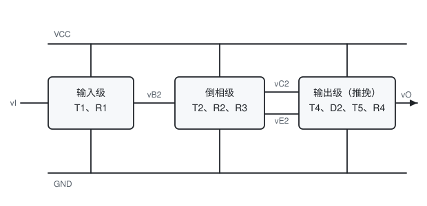

[数电](./数电.md) / 第三章 门电路 / 3.5 TTL门电路 / TTL反相器

# TTL反相器

## 核心结论

TTL 反相器由**输入级, 倒相级, 推挽输出级**三级组成. 它的关键优势是推挽输出使高低电平都有低阻驱动, 速度快, 带载能力强; 代价是无论输出为何值都有静态电流, 功耗远大于 CMOS.

## 一、三级结构

| 级     | 组成           | 作用                                               |
| ------ | -------------- | -------------------------------------------------- |
| 输入级 | T1, R1         | 把输入电平转换为驱动 T2 的电流, 并实现输入钳位保护 |
| 倒相级 | T2, R2, R3     | 由 T2 的集电极与发射极输出**相位相反**的两个信号   |
| 输出级 | T4, D2, T5, R4 | 推挽(图腾柱) 输出, 两管互补导通                    |

**推挽输出的含义**: T4 与 D2 构成上拉支路, T5 构成下拉支路, 任何时刻只有一条支路导通:

- 输出高电平时 T4, D2 导通, T5 截止, 输出被**主动上拉**.
- 输出低电平时 T5 导通, T4, D2 截止, 输出被**主动下拉**.

这正是 TTL 驱动能力强, 速度快的原因, 也是它无法直接"线与"的原因(见 OC 门).

## 二、两种稳态的工作过程

设 $V_{CC} = 5\ \text{V}$, 输入低电平 0.2 V, 输入高电平 3.4 V.

**输入为低电平($v_I = 0.2\ \text{V}$)**:

1. T1 的发射结正偏导通, T1 基极电位 $v_{B1} \approx 0.9\ \text{V}$.
2. $v_{B1}$ 不足以使 T1 集电结, T2 发射结, T5 发射结这三个 PN 结导通, 故 T2, T5 均截止.
3. T2 截止使其集电极电位很高, T4 与 D2 导通, 输出被上拉.
4. 输出:$v_O = V_{CC} - v_{BE4} - v_{D2} \approx 5 - 0.7 - 0.7 = 3.6\ \text{V}$, 实测典型值约 3.4 V.

**输入为高电平($v_I = 3.4\ \text{V}$)**:

1. T1 的发射结反偏, T1 进入**倒置工作状态**(集电极与发射极角色互换).
2. 电流经 R1, T1 集电结, T2 发射结, T5 发射结流向地, 使 T2, T5 饱和导通,$v_{B1}$ 被钳位在约 2.1 V(三个 PN 结压降之和).
3. T2 饱和使其集电极电位 $v_{C2} \approx 0.9\ \text{V}$, 不足以使 T4, D2 导通, 上拉支路断开.
4. 输出:$v_O = V_{CES5} \approx 0.2\ \text{V}$.

**注意**: T1 在输入高电平时处于倒置状态, 这是 TTL 输入级最特殊之处, 也是理解输入电流方向的关键.

## 三、电压传输特性

| 区段       | 输入范围                              | 状态                   | 输出                        |
| ---------- | ------------------------------------- | ---------------------- | --------------------------- |
| 截止区(AB) | $v_I < 0.6\ \text{V}$                 | T2, T5 截止            | $v_O \approx 3.4\ \text{V}$ |
| 线性区(BC) | $0.6\ \text{V} < v_I < 1.3\ \text{V}$ | T2 导通放大, T5 仍截止 | $v_O$ 随 $v_I$ 近似线性下降 |
| 转折区(CD) | $v_I \approx 1.4\ \text{V}$           | T2, T5 迅速导通        | 陡降, 增益最大              |
| 饱和区(DE) | $v_I > 1.4\ \text{V}$                 | T2, T5 饱和            | $v_O \approx 0.2\ \text{V}$ |

**阈值电压**:$V_{TH} \approx 1.4\ \text{V}$.

## 四、输入端的特殊特性

**输入短路电流** $I_{IS}$: 输入端接地时流出输入端的电流, 约 $-1.6\ \text{mA}$(负号表示电流从门流出). 这是计算扇出和前级负载的依据.

**输入漏电流** $I_{IH}$: 输入端接高电平时流入输入端的电流, 约 $40\ \mu\text{A}$(倒置状态下 T1 的集电结反向漏电流).

**输入负载特性**: 输入端通过电阻 $R$ 接地时, 输入电平由电阻分压决定:

$$v_I \approx \frac{V_{CC} - v_{BE1}}{R_1 + R} \cdot R$$

- 关门电阻 $R_{OFF} \approx 0.7\ \text{k}\Omega$:$R < R_{OFF}$ 时输入被认定为低电平.
- 开门电阻 $R_{ON} \approx 2\ \text{k}\Omega$:$R > R_{ON}$ 时输入被认定为高电平.

**实用推论**: TTL 输入端悬空等效为**高电平**(因为无电流流出, T1 发射结不导通, 行为与接高电平相同). 但这不是规范做法, 悬空端极易拾取干扰, 实际设计中应通过上拉电阻接 $V_{CC}$ 或与使用端并联.

## 五、TTL 与非门

把 T1 换成**多发射极三极管**, 每个发射极作为一个输入端, 即构成 TTL 与非门(如 74LS00). 只要任一发射极为低电平, T1 导通, T2, T5 截止, 输出高电平; 只有全部发射极为高电平时, T2, T5 才导通, 输出低电平.

$$F = \overline{AB}$$

多发射极管的发射极之间存在**交叉漏电流**, 当某个输入端接高电平而另一输入端接低电平时会产生额外电流, 设计时需留余量.

## 六、与 CMOS 反相器的对比

| 对比项   | TTL 反相器           | CMOS 反相器       |
| -------- | -------------------- | ----------------- |
| 输出结构 | 推挽(双极型管)       | 互补(PMOS + NMOS) |
| 静态功耗 | 数毫瓦               | 近乎为零          |
| 驱动能力 | 强(灌电流可达 16 mA) | 较弱(约 ±4 mA)    |
| 输入电流 | 毫安级               | 近乎为零          |
| 噪声容限 | 约 0.4 V             | 约 $0.45 V_{DD}$  |
| 速度     | 快(10 ns 级)         | 74HC 系列已相当   |
| 能否线与 | 不能直接线与         | 不能直接线与      |

## 易错点

- TTL 输入端悬空等效高电平, 但 CMOS 输入端悬空是故障, 两者规则相反, 不能混用.
- 输出高电平典型值 3.4 V, 但参数手册保证的最低值是 2.4 V, 计算噪声容限时必须用**保证值**而不是典型值.

## 相关笔记

- 电气参数的系统整理:[TTL门电路电气特性](./TTL门电路电气特性.md)
- 线与与总线的解决方案:[OC门与三态门](./OC门与三态门.md)
- 对比:[CMOS反相器](./CMOS反相器.md)
