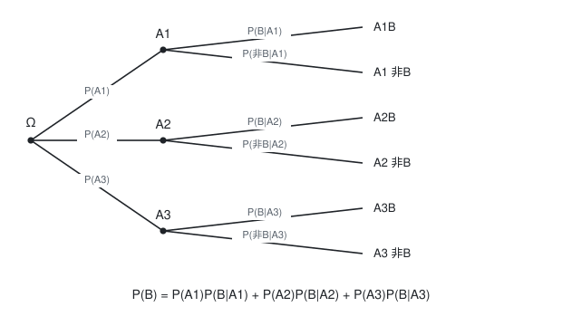

[概率论](./概率论.md) / 一、随机事件与概率

# 全概率公式

全概率公式解决的问题是:**当一个事件 $B$ 可以由若干条互不相交的"途径"产生时, 如何通过每条途径的概率加权求和得到 $P(B)$**. 它是"先分类, 再分步"思想的形式化.

## 一、完备事件组

设 $A_1,A_2,\ldots,A_n$ 为一组事件, 若满足

1. 两两互斥: $A_iA_j=\varnothing\ (i\ne j)$;
2. 并起来是全集: $\displaystyle\bigcup_{i=1}^{n}A_i=\Omega$;

则称 $A_1,\ldots,A_n$ 构成一个**完备事件组**(样本空间的一个划分). 条件 1 保证"途径不重叠", 条件 2 保证"途径穷尽", 二者缺一不可.

## 二、定理

设 $A_1,\ldots,A_n$ 是完备事件组, 且 $P(A_i)>0\ (i=1,\ldots,n)$, 则对任意事件 $B$ 有

$$P(B)=\sum_{i=1}^{n}P(A_i)\,P(B\mid A_i)$$

这就是**全概率公式**.

**证明**: 因为 $\bigcup_i A_i=\Omega$, 有

$$B=B\Omega=B\left(\bigcup_{i=1}^{n}A_i\right)=\bigcup_{i=1}^{n}BA_i$$

又因为 $A_i$ 两两互斥, 故 $BA_i$ 也两两互斥. 由有限可加性

$$P(B)=\sum_{i=1}^{n}P(BA_i)=\sum_{i=1}^{n}P(A_i)P(B\mid A_i)$$

最后一步用了乘法公式. 证毕.

下图是 $n=3$ 时的概率树, 树的最右端六个叶子恰好把 $B$ 拆成互不重叠的三个部分:

## 三、什么时候用全概率公式

识别标准: 题目描述的试验天然分成**两个阶段或两条以上的途径**, 而要求的是**第二阶段结果**的无条件概率. 典型标志语:

- "随机选一个盒子/箱子/车间/批次, 再从中取一件";
- "第一批是……第二批是……混合后任取一件";
- "视某某情况的种类而定".

**使用步骤**:

1. 找划分: 明确第一阶段的所有可能情形 $A_1,\ldots,A_n$, 并检查它们构成完备事件组;
2. 写概率: 给出每个 $P(A_i)$;
3. 写条件概率: 给出每个 $P(B\mid A_i)$;
4. 代入公式求和.

## 四、例题

**例 1**(生产线): 某厂有甲, 乙, 丙三条生产线, 产量分别占总产量的 $25\%,35\%,40\%$, 次品率分别为 $5\%,4\%,2\%$. 随机取一件产品, 求它是次品的概率.

解: 记 $A_1,A_2,A_3$ 分别表示产品来自甲, 乙, 丙线, $B$ 表示产品为次品. 则

$$P(A_1)=0.25,\ P(A_2)=0.35,\ P(A_3)=0.40$$
$$P(B\mid A_1)=0.05,\ P(B\mid A_2)=0.04,\ P(B\mid A_3)=0.02$$

由全概率公式

$$P(B)=0.25\times0.05+0.35\times0.04+0.40\times0.02$$
$$=0.0125+0.0140+0.0080=0.0345$$

即次品率约为 $3.45\%$.

**例 2**(选箱子): 甲箱中有 3 个红球, 2 个白球; 乙箱中有 1 个红球, 4 个白球. 先随机选一个箱子(选到任一箱的概率均为 $\frac12$), 再从中任取一球. 求取到红球的概率.

解: 记 $A_1=\{\text{选中甲箱}\}$, $A_2=\{\text{选中乙箱}\}$, $B=\{\text{取到红球}\}$:

$$P(B)=P(A_1)P(B\mid A_1)+P(A_2)P(B\mid A_2)=\frac12\times\frac35+\frac12\times\frac15=\frac{3}{10}+\frac{1}{10}=\frac25=0.4$$

**例 3**(不放回抽球): 袋中有 $a$ 个白球, $b$ 个黑球, 不放回取两次. 求第二次取到白球的概率.

解: 以第一次的结果作划分: $A_1=\{\text{第一次白}\}$, $A_2=\{\text{第一次黑}\}$:

$$P(A_1)=\frac{a}{a+b},\quad P(A_2)=\frac{b}{a+b}$$
$$P(\text{第二次白}\mid A_1)=\frac{a-1}{a+b-1},\quad P(\text{第二次白}\mid A_2)=\frac{a}{a+b-1}$$

$$P(\text{第二次白})=\frac{a}{a+b}\cdot\frac{a-1}{a+b-1}+\frac{b}{a+b}\cdot\frac{a}{a+b-1}=\frac{a}{a+b}$$

结果与第一次取到白球的概率相同, 再次印证抽签公平性.

## 五、易错点

- **划分不完备**: 只想到了部分情形(例如漏了"两箱都没选中"), 结果偏小.
- **划分不互斥**: 情形之间有重叠, 会重复计入.
- 把 $P(B\mid A_i)$ 与 $P(A_i\mid B)$ 搞混: 全概率公式要的是前者("已知原因求结果"), 若题目要求后者就应当转向**贝叶斯公式**.
- 忽略 $P(A_i)>0$ 的前提.

## 相关笔记

- 上一篇:[乘法定理](./乘法定理.md)
- 下一篇:[贝叶斯公式](./贝叶斯公式.md)
- 返回索引:[概率论](./概率论.md)
