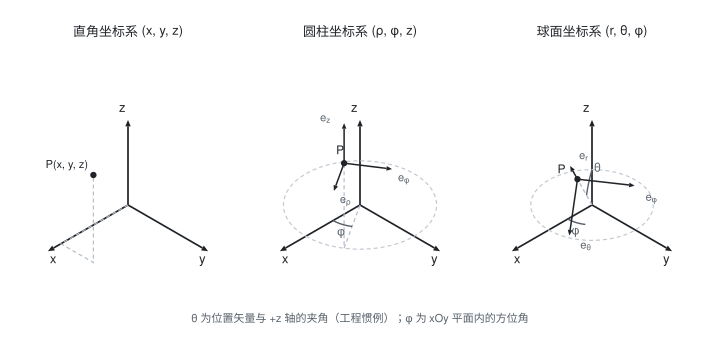

[电磁场与波](./电磁场与波.md) / 1. 矢量分析 / 1.3 圆柱坐标系

# 圆柱坐标系

圆柱坐标系适用于具有**圆柱对称性**的问题(同轴线, 圆柱导体, 螺线管). 它与直角坐标系的最大区别是: **$\boldsymbol e_\rho$ 与 $\boldsymbol e_\phi$ 的方向随 $\phi$ 变化**.

## 一、定义

空间中一点 $P$ 用三个坐标 $(\rho,\phi,z)$ 表示:

- $\rho$: 点 $P$ 到 $z$ 轴的**垂直距离**, $0\le\rho<+\infty$;
- $\phi$: 在 $xOy$ 平面内从 $x$ 轴逆时针量到投影点的**方位角**, $0\le\phi<2\pi$;
- $z$: 与直角坐标的 $z$ 相同, $-\infty<z<+\infty$.

三个单位矢量 $\boldsymbol e_\rho,\boldsymbol e_\phi,\boldsymbol e_z$ 分别指向 $\rho,\phi,z$ **增大的方向**, 构成右手正交系:

$$\boldsymbol e_\rho\times\boldsymbol e_\phi=\boldsymbol e_z,\qquad \boldsymbol e_\phi\times\boldsymbol e_z=\boldsymbol e_\rho,\qquad \boldsymbol e_z\times\boldsymbol e_\rho=\boldsymbol e_\phi$$

下图给出三种正交坐标系的示意:

## 二、与直角坐标系的互换

**坐标变换**:

$$x=\rho\cos\phi,\qquad y=\rho\sin\phi,\qquad z = z$$
$$\rho=\sqrt{x^2 + y^2},\qquad \phi=\arctan\frac yx,\qquad z = z$$

**矢量分量的变换**:

$$A_\rho = A_x\cos\phi + A_y\sin\phi,\qquad A_\phi=-A_x\sin\phi + A_y\cos\phi,\qquad A_z = A_z$$

**单位矢量的变换**(推导上式的基础):

$$\boldsymbol e_\rho=\boldsymbol e_x\cos\phi+\boldsymbol e_y\sin\phi,\qquad \boldsymbol e_\phi=-\boldsymbol e_x\sin\phi+\boldsymbol e_y\cos\phi$$

## 三、矢量的表示

$$\boldsymbol A = A_\rho\boldsymbol e_\rho + A_\phi\boldsymbol e_\phi + A_z\boldsymbol e_z$$

$$|\boldsymbol A|=\sqrt{A_\rho^2 + A_\phi^2 + A_z^2}$$

## 四、微分元

**线元**(注意 $\phi$ 方向的弧长带有因子 $\rho$):

$$d\boldsymbol l=\boldsymbol e_\rho d\rho+\boldsymbol e_\phi\,\rho\,d\phi+\boldsymbol e_z dz$$

**面积元**:

$$dS_\rho=\rho\,d\phi\,dz,\qquad dS_\phi = d\rho\,dz,\qquad dS_z=\rho\,d\rho\,d\phi$$

**体积元**:

$$dV=\rho\,d\rho\,d\phi\,dz$$

**要点**: 弧长元在 $\phi$ 方向是 $\rho d\phi$ 而不是 $d\phi$; 体积元比直角坐标多一个因子 $\rho$. 这个 $\rho$ 在后面的面积分与体积分中极易漏掉.

## 五、坐标系的关键区别(易错核心)

在直角坐标中 $\boldsymbol e_x,\boldsymbol e_y$ 是常矢量; 但在圆柱坐标中

$$\frac{\partial\boldsymbol e_\rho}{\partial\phi}=\boldsymbol e_\phi,\qquad \frac{\partial\boldsymbol e_\phi}{\partial\phi}=-\boldsymbol e_\rho$$

即**单位矢量本身随 $\phi$ 变化**. 因此求 $\dfrac{\partial\boldsymbol A}{\partial\phi}$ 时必须用乘积求导法则:

$$\frac{\partial\boldsymbol A}{\partial\phi}=\frac{\partial A_\rho}{\partial\phi}\boldsymbol e_\rho + A_\rho\boldsymbol e_\phi+\frac{\partial A_\phi}{\partial\phi}\boldsymbol e_\phi - A_\phi\boldsymbol e_\rho+\frac{\partial A_z}{\partial\phi}\boldsymbol e_z$$

## 六、例题

**例 1**: 把直角坐标系中的点 $(3,4,5)$ 化为圆柱坐标.

解:

$$\rho=\sqrt{3^2 + 4^2} = 5,\qquad \phi=\arctan\frac43\approx53.1^\circ,\qquad z = 5$$

即 $(\rho,\phi,z) = (5,53.1^\circ,5)$.

**例 2**: 已知在圆柱坐标中 $\boldsymbol A = 2\boldsymbol e_\rho + 3\boldsymbol e_z$. 求它在直角坐标系中的分量(设 $\phi = 30^\circ$).

解: 由分量变换式, 取 $A_\rho = 2$, $A_\phi = 0$:

$$A_x = A_\rho\cos\phi - A_\phi\sin\phi = 2\cos30^\circ=\sqrt3\approx1.732$$
$$A_y = A_\rho\sin\phi + A_\phi\cos\phi = 2\sin30^\circ = 1$$
$$A_z = 3$$

**例 3**: 求半径为 $a$, 高为 $h$ 的圆柱体体积(用圆柱坐标).

解:

$$V=\iiint dV=\int_0^h\int_0^{2\pi}\int_0^a\rho\,d\rho\,d\phi\,dz = h\cdot2\pi\cdot\frac{a^2}{2}=\pi a^2h$$

**例 4**: 求圆柱坐标中 $\phi$ 方向一段弧(半径 $\rho = a$, 张角 $\Delta\phi$)的长度.

解:

$$l=\int_0^{\Delta\phi}a\,d\phi = a\,\Delta\phi$$

## 七、易错点

- **漏掉 $\rho$ 因子**: 弧长元 $\rho d\phi$、面积元 $\rho d\phi dz$、体积元 $\rho d\rho d\phi dz$ 中的 $\rho$ 不可省.
- 把 $\boldsymbol e_\rho,\boldsymbol e_\phi$ 当常矢量求导.
- $\phi$ 的取值范围与 $\arctan$ 的象限判断: 应根据 $(x,y)$ 所在象限确定, 不能一律取主值.
- 混淆 $A_\phi$ 与方位角 $\phi$ 本身.

## 相关笔记

- 上一篇: [直角坐标系](./直角坐标系.md)
- 下一篇: [球面坐标系](./球面坐标系.md)
- 返回索引: [电磁场与波](./电磁场与波.md)
