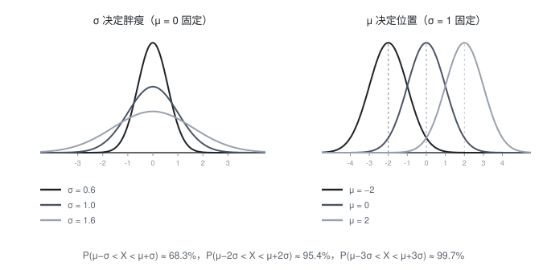

[概率论](./概率论.md) / 2. 随机变量及其分布 / 2.12 正态分布

# 正态分布

正态分布(高斯分布)是概率论中最重要的连续型分布. 测量误差, 身高体重, 血压, 考试成绩, 以及大量独立微小因素之和, 都近似服从正态分布.

## 一、定义

若连续型随机变量 $X$ 的概率密度为

$$f(x)=\frac{1}{\sqrt{2\pi}\,\sigma}e^{-\frac{(x-\mu)^2}{2\sigma^2}},\qquad -\infty<x<+\infty$$

其中 $\mu$ 为任意实数, $\sigma>0$ 为常数, 则称 $X$ 服从参数为 $\mu,\sigma$ 的**正态分布**, 记为

$$X\sim N(\mu,\sigma^2)$$

## 二、密度曲线的性质

$f(x)$ 的图形是一条"钟形曲线", 具有以下特点:

1. **关于 $x=\mu$ 对称**;
2. 在 $x=\mu$ 处取得最大值 $f(\mu)=\dfrac{1}{\sqrt{2\pi}\,\sigma}$;
3. $x=\mu\pm\sigma$ 处为**拐点**;
4. 当 $x\to\pm\infty$ 时 $f(x)\to 0$, 以 $x$ 轴为渐近线;
5. 曲线与 $x$ 轴之间的总面积为 1.

参数的作用:

- $\mu$ 决定曲线的**位置**(左右平移), 且 $E(X)=\mu$;
- $\sigma$ 决定曲线的**胖瘦**(分散程度), $\sigma$ 越小越陡峭, 且 $D(X)=\sigma^2$.

下图直观对比了 $\mu$ 与 $\sigma$ 各自的作用:

## 三、数字特征

$$E(X)=\mu,\qquad D(X)=\sigma^2$$

这两个参数同时是位置参数与尺度参数, 记 $N(\mu,\sigma^2)$ 时**第二个参数是方差而不是标准差**.

## 四、$3\sigma$ 原则

若 $X\sim N(\mu,\sigma^2)$, 则

$$P(\mu-\sigma<X<\mu+\sigma)\approx 0.683$$
$$P(\mu - 2\sigma<X<\mu + 2\sigma)\approx 0.954$$
$$P(\mu - 3\sigma<X<\mu + 3\sigma)\approx 0.997$$

即**落在 $(\mu - 3\sigma,\mu + 3\sigma)$ 之外的概率不到 $0.3\%$**. 因此在实际问题中常把 $3\sigma$ 区间当作"正常范围", 超出就认为是异常(质量控制中的 $3\sigma$ 控制图即源于此).

## 五、为什么正态分布如此重要

1. **误差模型**: 大量微小独立因素叠加形成的误差近似服从正态;
2. **中心极限定理**: 独立同分布随机变量之和的标准化变量趋于 $N(0,1)$(本系列第五章);
3. **数学性质优良**: 线性变换, 独立和, 边缘分布等在正态族内封闭, 便于运算;
4. 许多统计推断方法(区间估计, 假设检验)都建立在正态假定之上.

## 六、标准化

若 $X\sim N(\mu,\sigma^2)$, 则

$$Z=\frac{X-\mu}{\sigma}\sim N(0,1)$$

这一步称为**标准化**(详见[正态变量的线性变换](./正态变量的线性变换.md)): 任何正态计算都可以先化成标准正态再查表.

## 七、例题

**例 1**: 设 $X\sim N(0,1)$, 求 $P(X<1)$, $P(-1<X<2)$, $P(X>2)$(已知 $\Phi(1) = 0.8413$, $\Phi(2) = 0.9772$).

解: 此处 $\Phi$ 是标准正态的分布函数:

$$P(X<1)=\Phi(1) = 0.8413$$
$$P(-1<X<2)=\Phi(2)-\Phi(-1)=\Phi(2)-\bigl(1-\Phi(1)\bigr) = 0.9772 - 0.1587 = 0.8185$$
$$P(X>2) = 1-\Phi(2) = 1 - 0.9772 = 0.0228$$

**例 2**: 设某次考试的成绩 $X\sim N(70,10^2)$. 求成绩在 60 到 85 之间的概率, 以及成绩高于 90 的概率($\Phi(1) = 0.8413$, $\Phi(1.5) = 0.9332$, $\Phi(2) = 0.9772$).

解: 先标准化 $Z=\frac{X - 70}{10}$:

$$P(60<X<85) = P(-1<Z<1.5)=\Phi(1.5)-\Phi(-1) = 0.9332-\bigl(1 - 0.8413\bigr) = 0.7745$$
$$P(X>90) = P(Z>2) = 1-\Phi(2) = 0.0228$$

**例 3**: 设 $X\sim N(\mu,\sigma^2)$ 且 $P(X<2) = 0.5$, $P(X<4) = 0.8413$, 求 $\mu$ 与 $\sigma$.

解: 由 $P(X<2) = 0.5$ 及正态曲线关于 $\mu$ 对称, 得 $\mu = 2$. 又

$$P(X<4)=\Phi\!\left(\frac{4 - 2}{\sigma}\right)=\Phi\!\left(\frac{2}{\sigma}\right) = 0.8413=\Phi(1)$$

故 $\frac{2}{\sigma} = 1$, 即 $\sigma = 2$.

## 八、易错点

- 把 $N(\mu,\sigma^2)$ 中的第二个参数当成标准差: 它是**方差**, $N(0,4)$ 的 $\sigma = 2$.
- 标准化时除以 $\sigma$ 而不是 $\sigma^2$: 正确是 $Z=\dfrac{X-\mu}{\sigma}$.
- 计算 $P(a<X<b)$ 时不作标准化就直接查表.
- 认为正态分布一定关于原点对称: 只有 $\mu = 0$ 时才对原点对称, 一般只是关于 $x=\mu$ 对称.
- 对连续型随机变量写成 $P(X<2) = P(X\le2)$ 是对的, 但对离散型则不然, 需分清.

## 相关笔记

- 上一篇: [指数分布](./指数分布.md)
- 下一篇: [标准正态分布](./标准正态分布.md)
- 返回索引: [概率论](./概率论.md)
