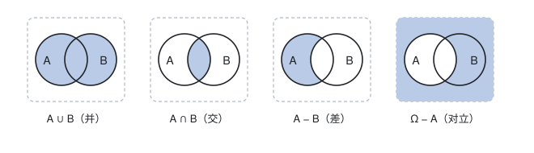

[概率论](./概率论.md) / 1. 随机事件与概率 / 1.2 随机事件间的关系与运算

# 随机事件间的关系与运算

把样本空间 $\Omega$ 看成全集之后,"事件"就是它的子集, 事件的关系与运算完全等同于**集合的关系与运算**. 这一篇是整个概率计算的语法基础.

## 一、随机事件

- **随机事件**: 样本空间 $\Omega$ 的子集, 常用大写字母 $A,B,C$ 表示. 事件 $A$ 发生, 当且仅当试验结果 $\omega\in A$.
- **基本事件**: 只含一个样本点的事件, 即单点集 $\{\omega\}$.
- **必然事件**: $\Omega$ 本身, 每次试验必发生.
- **不可能事件**: 空集 $\varnothing$, 每次试验必不发生.

**例 1**: 掷一枚骰子, 令 $A=\{\text{点数为偶数}\}=\{2,4,6\}$, $B=\{\text{点数大于 4}\}=\{5,6\}$. 则 $A$ 是复合事件, $\{3\}$ 是基本事件.

## 二、事件间的关系

| 关系           | 记号                                       | 含义                         |
| -------------- | ------------------------------------------ | ---------------------------- |
| 包含           | $A\subset B$                               | $A$ 发生必然导致 $B$ 发生    |
| 相等           | $A = B$                                    | $A\subset B$ 且 $B\subset A$ |
| 互斥(互不相容) | $AB=\varnothing$                           | $A$ 与 $B$ 不能同时发生      |
| 对立(互逆)     | $A\bar A=\varnothing,\ A\cup\bar A=\Omega$ | 有且仅有一个发生             |

**互斥与对立的区别**(高频考点):

- 互斥只要求"不能同时发生", 允许"都不发生"; 掷骰子时"点数为 1"与"点数为 2"互斥但不对立;
- 对立要求"有且仅有一个发生", 既互斥又**穷尽**;"点数为偶数"与"点数为奇数"才是对立事件.

推而广之, 若 $A_1,A_2,\ldots,A_n$ 两两互斥且 $\bigcup_{i = 1}^{n}A_i=\Omega$, 则称它们构成一个**完备事件组**(样本空间的一个划分). 它是全概率公式的使用前提.

## 三、事件的运算

| 运算   | 记号                 | 含义                      |
| ------ | -------------------- | ------------------------- |
| 和(并) | $A\cup B$ 或 $A + B$ | $A$ 与 $B$ 至少有一个发生 |
| 积(交) | $A\cap B$ 或 $AB$    | $A$ 与 $B$ 同时发生       |
| 差     | $A - B$ 或 $A\bar B$ | $A$ 发生而 $B$ 不发生     |
| 对立   | $\bar A=\Omega - A$  | $A$ 不发生                |

下图给出四种运算的直观图形(文氏图), 阴影部分为运算结果:

优先级约定: **先求逆, 再求交, 最后求并**, 与"先乘除后加减"同理.

## 四、把语言翻译成事件

**例 2**: 设 $A,B,C$ 为三个事件, 用记号表示下列事件.

| 表述                      | 事件                                                      |
| ------------------------- | --------------------------------------------------------- |
| $A$ 发生而 $B$ 不发生     | $A - B = A\bar B$                                         |
| $A,B$ 都发生而 $C$ 不发生 | $AB\bar C$                                                |
| 三个事件都发生            | $ABC$                                                     |
| 三个事件中至少一个发生    | $A\cup B\cup C$                                           |
| 三个事件都不发生          | $\overline{A\cup B\cup C}=\bar A\bar B\bar C$             |
| 恰有一个发生              | $A\bar B\bar C\ \cup\ \bar AB\bar C\ \cup\ \bar A\bar BC$ |
| 至少两个发生              | $AB\cup AC\cup BC$                                        |
| 不多于一个发生            | $\overline{AB\cup AC\cup BC}$                             |

**要点**:"至少一个"通常翻译成**并**,"同时"翻译成**交**,"恰好/只有"翻译成"交上若干个逆事件", 并且"至少一个"与"都不"互为对立, 这一对经常用来**正难则反**.

**例 3**: 甲, 乙两人各射击一次, 令 $A=\{\text{甲命中}\}$, $B=\{\text{乙命中}\}$, 用记号表示"恰有一人命中".

$$A\bar B\cup \bar AB = (A\cup B) - AB$$

两种写法等价, 后者在计算概率时更方便: $P(A\bar B\cup\bar AB) = P(A\cup B) - P(AB)$.

## 五、易错点

- 把"互斥"当"对立": 只有两个事件时才需要检验是否穷尽; 三个及以上事件的互斥绝不等于对立.
- 记号 $AB$ 表示交, 不是"先 $A$ 后 $B$"; 事件的运算没有先后之分.
- 德摩根律记反方向: 长杠变短杠时,"并变交, 交变并"(详见下一篇), 常写成 $\overline{A\cup B}=\bar A\cap\bar B$ 而不是 $\bar A\cup\bar B$.

## 相关笔记

- 上一篇: [随机试验与样本空间](./随机试验与样本空间.md)
- 下一篇: [事件的运算律](./事件的运算律.md)
- 返回索引: [概率论](./概率论.md)
